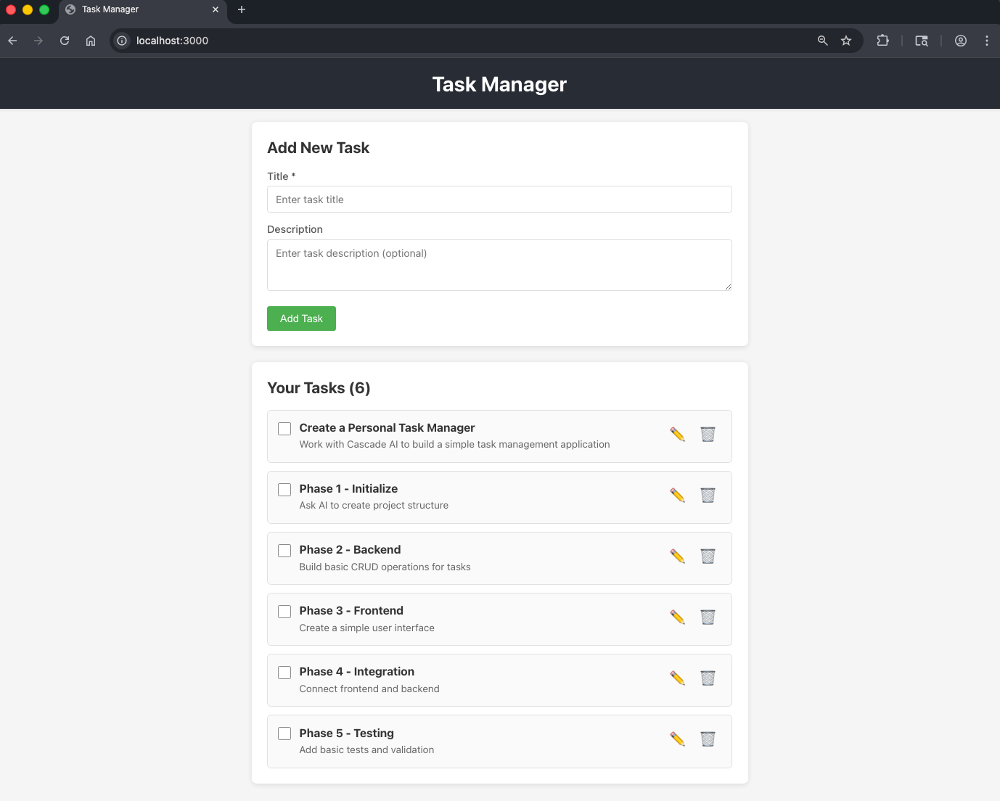
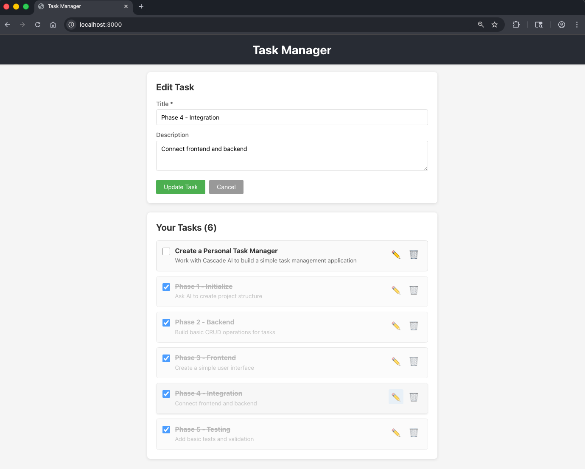

# Task Manager Application

A simple task manager built with Node.js/Express backend and React frontend.

## Features

- Create tasks with title and description
- Mark tasks as complete/incomplete
- Edit existing tasks
- Delete tasks
- Persistent storage using JSON file

## Project Structure

```
task-manager/
├── backend/                 # Express API server
│   ├── server.js           # Main server file
│   ├── routes/
│   │   └── tasks.js        # Task CRUD endpoints
│   ├── middleware/
│   │   └── errorHandler.js # Error handling middleware
│   └── data/
│       └── tasks.json      # Task storage
└── frontend/               # React application
    ├── public/
    │   └── index.html      # HTML template
    └── src/
        ├── App.js          # Main component
        ├── components/     # React components
        └── services/
            └── api.js      # API service layer
```

## Getting Started

### Prerequisites

- Node.js (v14 or higher)
- npm

### Installation & Running

1. **Start the Backend Server**

   Open a terminal and run:
   ```bash
   cd backend
   npm start
   ```
   
   The backend will run on http://localhost:5000

2. **Start the Frontend Application**

   Open a NEW terminal window and run:
   ```bash
   cd frontend
   npm start
   ```
   
   The frontend will run on http://localhost:3000 and open in your browser

## API Endpoints

- `GET /api/tasks` - Get all tasks
- `GET /api/tasks/:id` - Get a single task
- `POST /api/tasks` - Create a new task
- `PUT /api/tasks/:id` - Update a task
- `DELETE /api/tasks/:id` - Delete a task

## Task Data Model

```javascript
{
  id: "unique-id",
  title: "Task title",
  description: "Task description",
  completed: false,
  createdAt: "2024-01-01T00:00:00.000Z"
}
```

## Technologies Used

### Backend
- Express.js - Web framework
- CORS - Cross-origin resource sharing
- Node.js File System - JSON file storage

### Frontend
- React - UI library
- React Hooks - State management
- Fetch API - HTTP requests
- CSS - Styling

## Application Screenshots





## Acknowledgments

This is an independent educational and portfolio project. This repository was built by me with assistance from AI coding tools for planning, implementation support, and documentation refinement.
